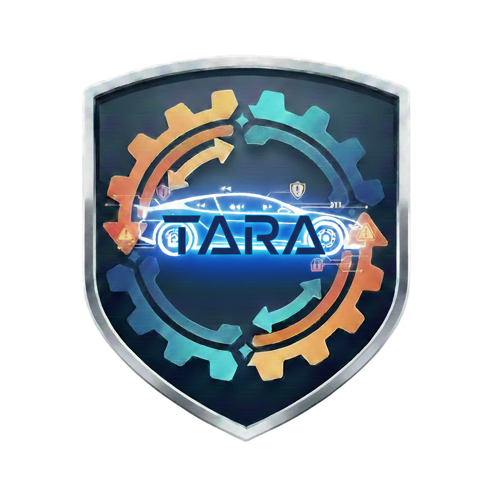

 
  

  <h1 align="center">ThreatCraft</h1>

  

    
    
  

 <b>ThreatCraft</b> is a hybrid threat modeling tool that combines rule-based reasoning with large language models to generate structurally valid and realistic attack paths, addressing limitations of prior approaches such as expert dependency, inconsistency, and hallucinated scenarios.
 

